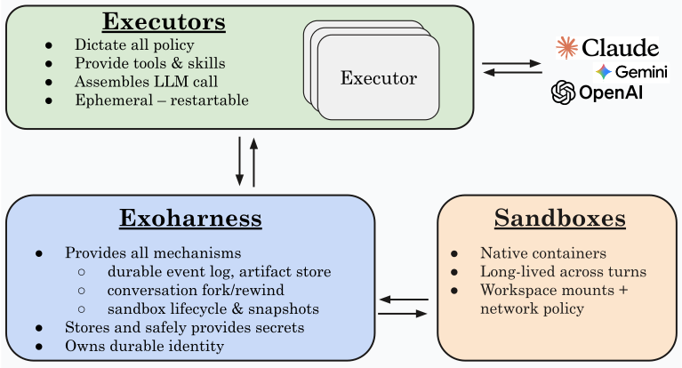
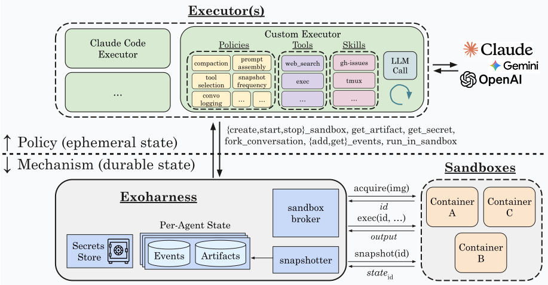

# exo

Exo is a minimal system for building agents. It separates the trusted
infrastructure needed for state, resources, and security from agent-specific
logic.



The goal is to provide a small, durable kernel for agents: minimal enough to
stay independent of any particular agent design, but complete enough to support
agents of arbitrary complexity. That includes agents that safely evolve their
own implementations, such as tools, compute environments, and memory systems.

Because the trusted substrate is separate from the agent code changing above it,
agents can fork, rewind, or return to known-good states without losing critical
state such as secrets, config, or history.

This directory contains the exoharness. And everything you need to build your
own agent from scratch, or to back Codex, Claude Code, or the Cursor SDK with
durable sessions you can stop, resume, and rewind across runs.

## The Why and What of Exo

Enabling powerful autonomy requires agents to be (1) **adaptable**, i.e. be able to adapt their policies, tools, and architecture to a target domain, and (2) **trustworthy**, i.e. be durable across crashes, isolated from one another, and recoverable to known-good states. Existing harnesses struggle to provide both: most agent systems conflate trusted infrastructure with agent-specific implementations (such as prompts and memory compaction), which makes reuse, recovery, isolation, and self-modification hard.

The `exo` agent harness instead decouples trusted infrastructure from agent-specific implementations into two halves:

1. The **exoharness** as the durable substrate that owns identity (agents, conversations, turns), history (event log), artifacts, secrets, and sandbox management. It is trusted and stateful.
2. The **executor** as the policy layer that owns prompt assembly, model calling, tool dispatch, memory compaction, approvals, etc., i.e. all _semantic_ decisions about how the agent behaves. It is ephemeral, swappable, and can be killed without losing the agent.



This architecture pushes the minimal infrastructure into the protected exoharness to enforce safety, while leaving all non-safety-essential components to the executor to manage and evolve at will. Decisions that affect what an agent means or does belong in the executor, or in
the agent itself. The exoharness provides the durable building blocks those
decisions run on: history, state, secrets, and sandboxing.

Because the exoharness substrate doesn't depend on the executor, an agent built on exo can:

- **Fork or rewind** at any past event, without losing secrets, sandboxes, or history.
- **Swap executors**, running the same agent via Codex, Claude Code, the Cursor SDK, or your own executor, without rebuilding state.
- **Evolve safely** to change its own policy processes, with access to inspect its own history and artifacts while the exoharness isolates secrets and compute resources to maintain safety.

For the architectural model and terminology, see
[spec/exoharness.md](./spec/exoharness.md).

## Status

This repository is early software. The Rust crates, CLI, TypeScript harness
runtime, and example coding-agent harnesses are useful for experimentation, but
the public API should still be treated as unstable.

## Quick Start

Install Rust and pnpm, then build the CLI:

```bash
cargo build -p exo
./target/debug/exo --help
```

Register a model, then drop into a REPL:

```bash
./target/debug/exo secret set openai --env OPENAI_API_KEY
./target/debug/exo model register gpt-5.5 --secret openai
./target/debug/exo repl
```

`exo repl` reuses or creates a default agent and conversation and uses a
registered model, so you can start chatting in one command. It's a plain chat
with no shell sandbox; create a conversation explicitly when you want tools.

`--env` takes the variable name literally. Use `--value "$OPENAI_API_KEY"` if
you intentionally want the shell to expand the value.

For explicit control over agents, conversations, or a shell-enabled sandbox:

```bash
./target/debug/exo agent create --model gpt-5.5 "Sandbox Example"
./target/debug/exo conversation create sandbox-example "Local Dev"
./target/debug/exo repl --agent sandbox-example --conversation local-dev
```

The CLI stores state under `.exo` by default. Pass `--root <path>` to use a
different state directory.

## TypeScript Harnesses

TypeScript harnesses can own the turn loop while Rust owns durable exoharness
state. Install Node dependencies once:

```bash
pnpm install
```

Then create an agent backed by a TypeScript harness module:

```bash
./target/debug/exo --harness typescript agent create "TS Basic" \
  --module examples/typescript/basic-harness.ts \
  --model gpt-5.5
```

The `examples/typescript` directory also contains Codex, Claude Code, Cursor,
and recursive-language-model harness experiments.

For the coding-agent setup commands, see
[docs/coding-agent-harnesses.md](./docs/coding-agent-harnesses.md).

## Repository Layout

- `crates`: Rust workspace for the CLI, exoharness substrate, and executors.
- `typescript`: TypeScript harness runtime, model-runtime helpers, and
  adapter-specific support code.
- `examples/typescript`: runnable TypeScript harness examples.
- `containers`: sandbox images used by the coding-agent harness examples.
- `spec`: core architecture and terminology.
- `docs`: design notes for in-progress directions.
- `scripts`: development and live e2e utilities.

## Development

```bash
pnpm check
cargo test --workspace --all-targets
```

The repository includes a pre-commit hook installer:

```bash
pnpm prepare
```

## License

MIT
