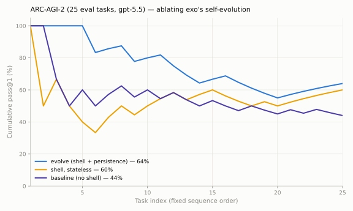

# Self-evolving exo on ARC-AGI-2: +20 points over its stateless baseline

| | |
|---|---|
| **Date** | 2026-07-01 (runs 21:34–23:36 UTC) |
| **Benchmark** | ARC-AGI-2, public evaluation split, first 25 tasks (alphabetical), scored exact-match |
| **Model** | gpt-5.5 (both arms) |
| **Code** | exo `evaluations` branch, commits `cf02dd8` (executor sandbox-scope fix), `b629bb3` (arc-agi `--evolve` mode) |
| **Raw results** | `evaluation/arc-agi/results/{evolve25,baseline25}.json`; full agent state kept at `evaluation/arc-agi/results/evolve-roots/evolve25/` |

## Headline

| Arm | pass@1 | pass@2 | Cost |
|---|---|---|---|
| **exo evolve** — one persistent self-evolving agent across all 25 tasks | **64% (16/25)** | 64% | $25.62 total, **$1.02/task** |
| **exo shell-stateless** (ablation, added 07-02) — same sandbox shell + verify-on-train-pairs prompt, but fresh agent per task: no memory, no feedback, no persistence | **60% (15/25)** | 60% | $17.00 total, $0.68/task |
| **exo baseline** — stateless, tool-less, one fresh agent per task | **44% (11/25)** | 44% | not instrumented (run pre-dated usage capture; single-shot calls, roughly $0.1–0.2/task) |

Same model, same 25 tasks, same order. The self-evolving arm solved **7 tasks
the baseline missed**; the baseline solved 2 the evolve arm missed; 9 were
solved by both.

**Attribution (via the ablation):** of evolve's +20 points over baseline, the
verification loop alone (shell + train-pair checking, no persistence) accounts
for **+16**; persistence (memory + verdict feedback) adds the remaining **+4**,
at ~1.5× the per-task cost. At 25-task sequence length, executing code against
the free per-task oracle is the dominant lever; cross-task learning is a real
but modest increment.

## What was tested

Whether exo's self-improvement kit — the same reusable pieces exoclaw composes —
buys measurable accuracy on a fluid-reasoning benchmark when an agent works
through a task sequence as *one persistent entity* instead of being reset:

- **Memory** (`remember`/`forget`, agent-scoped, injected every turn)
- **Self-authored tools** (`install_agent_tool`, persist across conversations)
- **Persistent sandbox** (agent-scoped docker container; files survive across
  tasks — enabled by the `cf02dd8` executor fix, since TS-module harnesses
  previously always got a fresh per-conversation sandbox)
- **Program-synthesis discipline** (prompt: implement the rule as code, verify
  it reproduces ALL train pairs before answering)

Protocol: each task is a fresh conversation against the same agent
(fresh context window; memory/tools/sandbox persist). After scoring, the runner
sends a verdict-only feedback turn (SOLVED/FAILED — no answer content), and the
agent gets one turn to update itself. This is a **continual-learning protocol**,
not the official leaderboard protocol. Answers cannot leak: the prompt embeds
the task JSON with test outputs stripped, the shell runs in a docker sandbox
with no host mount, and scoring stays host-side.

The baseline arm is the pre-existing tool-less pure-reasoning harness
(`harness-arc.ts`): no shell, no memory, fresh exo root per task.

## What the agent actually built itself

Inspecting the kept root after the run:

- **24 memory entries** — a motif playbook ("ARC motif solved: …") plus
  self-corrections. Examples (abridged):
  - *"large near-symmetric wallpaper with a rectangular region marked by color 8;
    output is the hidden original subgrid under the 8s, recovered from
    mirror/rotational symmetry"*
  - *"separator/wall color partitions grid into regions; sparse colored cells
    specify colors for successive concentric layers; fill by iterative
    8-neighbor erosion"*
  - *"ARC caution: … do not assume output packs all objects into one gap unless
    verified on train pairs"*
- **Zero installed TS tools** and **no persistent code library** — the sandbox
  held only the current task's `solve.py` + `task.json`, rewritten each task.

So the +20 points came from (a) the in-task program-synthesis loop (write the
transform, verify on every train pair, only then answer) and (b) accumulated
meta-knowledge in memory — **not** from a growing code toolkit. This echoes the
clbench finding: for correctness, persisted knowledge dominates persisted code.

## Caveats

1. ~~**Confounded arms.**~~ Resolved 07-02: the shell-but-stateless ablation arm
   (table above) attributes +16 of the +20 to the verification loop and +4 to
   persistence.
2. **Absolute scores are not leaderboard-comparable.** 44% single-shot on
   ARC-AGI-2 is far above published frontier results on the private test set;
   the public eval JSONs have been on GitHub for a year and gpt-5.5 has
   plausibly seen them. Deltas between arms (same model/tasks) remain
   meaningful; absolutes should not be quoted against arcprize.org.
3. **n=25** → 4-percentage-point granularity; the gap is 5 tasks.
4. **pass@2 added nothing** — the agent rarely emitted a second candidate
   despite the harness supporting `outputs2`. Prompt nudge pending.
5. Cumulative-accuracy curves (chart) show no clear *within-run* learning
   trend; ARC rules don't repeat within 25 tasks, so memory's value likely
   grows with longer sequences.

## Next

Six-arm ARC-AGI-1 cost-vs-score board (50 eval tasks; in flight as of this
report): gpt-5.5 direct, Claude Opus 4.8 direct, OpenClaw (gpt-5.5),
Hermes (gpt-5.5), exo baseline, exo evolve — feeding
`evaluation/shared/board/` for the leaderboard-style scatter.
