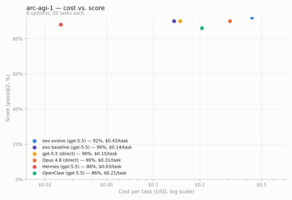

# ARC-AGI-1 cost-vs-score board: six systems, 50 tasks

| | |
|---|---|
| **Date** | 2026-07-02 (runs 23:44–02:44 UTC) |
| **Benchmark** | ARC-AGI-1, public evaluation split, first 50 tasks (alphabetical), exact-match, pass@2 headline (= pass@1 here; no arm used its second attempt) |
| **Systems** | gpt-5.5 direct, Claude Opus 4.8 direct, OpenClaw 2026.6.11 (gpt-5.5), Hermes (gpt-5.5), exo baseline (gpt-5.5), exo evolve (gpt-5.5) |
| **Cost basis** | token counts × `evaluation/shared/board/prices.json` (2026-07-01: gpt-5.5 $5/$30, Opus 4.8 $5/$25 per MTok; cached input at $0.50) |
| **Code** | exo `evaluations` branch; runner `evaluation/arc-agi/arc_runner.py` (`--backend`), board `evaluation/shared/board/` |
| **Raw results** | `data/arc-agi-1_*.json` (per-task solved + cost); runner summaries in `evaluation/arc-agi/results/board-*.json` |

## Board

| System | pass@1 | $/task | Total | Protocol |
|---|---|---|---|---|
| **exo evolve** (gpt-5.5) | **92%** (46/50) | $0.43 | $21.74 | continual-learning: persistent agent, verdict feedback |
| exo baseline (gpt-5.5) | 90% (45/50) | $0.14 | $6.82 | stateless, tool-less |
| gpt-5.5 (direct API) | 90% (45/50) | $0.15 | $7.47 | stateless single call |
| Opus 4.8 (direct API) | 90% (45/50) | $0.31 | $15.65 | stateless single call, adaptive thinking |
| Hermes (gpt-5.5) | 88% (44/50) | $0.03 | $1.26 | stateless one-shot turns |
| OpenClaw (gpt-5.5) | 86% (43/50) | $0.21 | $10.33 | stateless embedded turns |

## Findings

1. **Everything clusters at 86–92%.** The public ARC-AGI-1 eval set does not
   discriminate between 2026 frontier systems on accuracy — the set has been
   public for years and is likely in training data (see caveats). The x-axis
   (cost) is where systems actually separate.
2. **exo evolve tops the board (+2 over its baseline) at 3× the cost.** On
   this easy set the verification loop has little headroom — its first guesses
   are usually right anyway. Contrast with the hard set: on ARC-AGI-2 the same
   pair was **64% vs 44%** (see the 2026-07-01 report). Self-evolution pays
   where first-shot accuracy is low.
3. **Hermes is the efficiency outlier: 88% at $0.025/task** — 6× cheaper than a
   raw gpt-5.5 API call. Its fixed ~13k-token system prompt cache-hits across
   tasks (cached input bills at 10%), and it answers with few output tokens
   (no long visible reasoning). OpenClaw's bigger prompt (~26k) and chattier
   turns cost 8× Hermes for 2 points less.
4. **Opus 4.8 ties the gpt-5.5 arms at 90%** — after we fixed our own harness:
   the first run scored 74% with 10/13 misses being *unparsed truncations*
   (adaptive thinking blew through a 16k non-streaming `max_tokens`). Streaming
   + a 64k cap recovered it (2 unparsed remain). Lesson recorded: on Opus-class
   models with thinking enabled, never cap ARC-sized answers at 16k.
5. **Agent wrappers ≠ free accuracy.** Both OpenClaw (86%) and Hermes (88%)
   score *below* a bare gpt-5.5 API call (90%) on this benchmark — their
   personal-assistant system prompts and toolsets don't help grid reasoning.

## Caveats

- **Contamination:** public eval split, likely in every 2026 model's training
  data. Do not quote these absolutes against arcprize.org private-set numbers.
  Cross-arm deltas (same tasks, mostly same model) remain informative.
- **Protocol asymmetry:** exo evolve is the only stateful arm (verdict-only
  feedback after scoring; no answer content leaks — task JSONs are stripped,
  sandbox has no host mount). The other five are stateless.
- **Confound (open):** evolve differs from exo baseline in both persistence
  *and* having a shell (program-synthesis + verify on train pairs). A
  shell-but-stateless ablation arm is the planned decisive test.
- n=50 → 2-point granularity; the 86–92% spread is 3 tasks end to end.
- Costs depend on provider caching behavior (Hermes/OpenClaw benefit; the
  direct arms send unique prompts and can't cache).

## Next

- Shell-but-stateless ablation (attribute evolve's gain: verifier vs memory).
- Harder task mix (ARC-AGI-2 board panel exists: evolve 64% / baseline 44%).
- pass@2 nudge — no arm ever used its second attempt.
