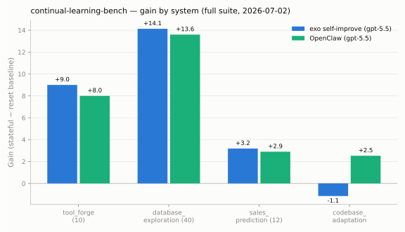

# continual-learning-bench: exo self-improve vs OpenClaw

| | |
|---|---|
| **Date** | 2026-07-02 (exo suite 03:56–06:36, OpenClaw suite 06:45–10:25 UTC) |
| **Benchmark** | clbench full suite: tool_forge (ours), database_exploration, sales_prediction, codebase_adaptation; `--schedule default`, `--runs 1 --max-workers 1` |
| **Metric** | **Gain** = stateful cumulative reward − stateless-reset baseline (clbench-native; the continual-learning effect itself) |
| **Systems** | exo `harness-selfimprove.ts` (memory + tool-creation + snapshot/rewind + introspection; pre-todowrite) via docker sandbox; OpenClaw 2026.6.11 embedded agent via new clbench adapter (`systems/openclaw/`), one persistent session per run, per-run temp state dir wiped on reset |
| **Model** | gpt-5.5 both |
| **Raw traces** | `/home/worker/clbench/results/<task>/traces/` (groups 2026-07-02T03..10Z) |

## Results

| Gain | exo self-improve | OpenClaw |
|---|---|---|
| tool_forge (10 inst) | **+9.0** | +8.0 |
| database_exploration (40q) | **+14.1** | +13.6 |
| sales_prediction (12) | **+3.2** | +2.9 |
| codebase_adaptation | −1.15 | **+2.53** |

## Findings

1. **Both systems genuinely learn across a task sequence.** Large positive
   gains for both on 3 of 4 tasks — e.g. on tool_forge both infer the hidden
   rate card from feedback and reuse it (blind baselines: 0/10 and 1/10).
2. **exo edges OpenClaw slightly wherever structured knowledge is the lever**
   (tool_forge, database_exploration, sales_prediction): explicit
   `remember`/`forget` memory injected each turn appears marginally more
   reliable than OpenClaw's implicit carrier (conversation history).
3. **codebase_adaptation flips the ranking**: OpenClaw's plain rolling session
   (+2.5) beat exo's self-improve kit (−1.15). The companion investigation
   (see `2026-07-02-selfimprove-vs-memory/`) explains exo's failure there:
   context overhead from carrying never-used tool-creation machinery — exo's
   no-tool-creation variant scores +2.5 on a matched slice, right at
   OpenClaw's level.
4. **Cost:** not comparable this round — clbench's parallel runner drops
   `system_artifacts`, so OpenClaw token usage wasn't captured (adapter
   records it; runner discards it). exo's investigation arms measured
   ~$7–14 per arm-task at these sizes.

## Caveats

- Single run per (system, task); cross-run variance on these tasks is ≥1–2
  gain points (see the companion report). Treat sub-2-point deltas as ties.
- OpenClaw ran with its stock personal-assistant system prompt (~25k tokens)
  plus a schema instruction per query; exo's prompt is benchmark-tuned. This
  is a "systems as shipped" comparison, not a matched-prompt one.
- exo's arm predates the todowrite upgrade (added later the same day).
