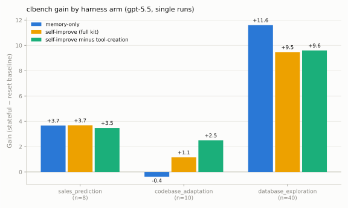

# Why does exo self-improve underperform memory-only? (It's context overhead, not bad tools)

| | |
|---|---|
| **Date** | 2026-07-02 (runs 07:05–14:43 UTC) |
| **Question** | Memory is a strict subset of the self-improve toolkit, yet memory-only runs have beaten self-improve on clbench. Why? |
| **Design** | 3 harness arms × 3 clbench tasks, matched slices, single runs. Arms: **memory-only** (`harness-memory.ts`); **self-improve** (`harness-selfimprove.ts`: memory + install_agent_tool + snapshot/rewind + introspection + todowrite); **si-notools** (`harness-si-notools.ts`: self-improve minus tool-creation — tool unregistered *and* prompt scrubbed) |
| **Model** | gpt-5.5 throughout |
| **Note** | Both self-improve arms include the new `todowrite` tool (PR #102, cherry-picked as part of this session); the morning full-suite run predates it |
| **Raw data** | gains from `si_investigation.log` (scratchpad); per-arm token accounting from kept exo roots; memory snapshots under `si_mem/` |

## Results

| Gain (stateful − reset baseline) | memory-only | self-improve | si-notools |
|---|---|---|---|
| sales_prediction (n=8) | +3.66 | +3.68 | +3.48 |
| codebase_adaptation (n=10) | **−0.38** | +1.15 | **+2.50** |
| database_exploration (full 40q) | **+11.60** | +9.47 | +9.60 |

Token accounting (from the agents' own event streams; per arm-task, stateful + baseline):

| Input tokens | memory-only | self-improve | Δ |
|---|---|---|---|
| sales_prediction | 2.67M | 3.63M | **+36%** |
| codebase_adaptation | 6.13M | 6.98M | +14% |
| database_exploration | 1.95M | 2.81M | **+44%** |

## The answer

1. **The agent almost never builds tools.** Across every self-improve run
   tonight — all three tasks, stateful and baseline episodes — the agent
   installed **zero** agent tools. (Only `tool_forge`, designed to reward a
   reusable calculator, ever elicits tool-building.) So the historical
   memory-vs-self-improve gap cannot be "bad tools mislead later episodes."
2. **The cost is carrying the machinery, not using it.** The self-improve arm
   pays +14–44% input tokens for identical work: extra tool schemas
   (install/uninstall, snapshot/rewind, introspection, todo) plus their
   instruction blocks are injected every model round. On
   database_exploration — where score depends on precise multi-step SQL
   exploration — that ambient load costs ~2 gain (11.6 → 9.5). Message counts
   are nearly identical across arms; the tokens go to longer prompts, i.e.
   attention dilution rather than extra turns.
3. **Tool-creation is the single worst offender on codebase_adaptation.**
   Removing just it (si-notools) more than doubled the gain over full
   self-improve (+2.50 vs +1.15) — again with zero tools ever built: the
   prompt actively pushes "stop and write yourself a reusable TypeScript tool,"
   which is a pure distraction on an action-channel task whose one command per
   turn is executed by the *task*, not the agent.
4. **But the kit isn't all cost.** On codebase_adaptation both self-improve
   arms beat memory-only by +1.5–2.9 — the todo/planning layer plausibly helps
   on 40-step issues (consistent with it being the only new mechanism the
   agent actually exercised). Effects are task-dependent, not monotone.

## Caveats

- **Single runs, no error bars.** Cross-day variance is material: the morning
  full-suite self-improve run (no todos) scored **+14.1** on
  database_exploration vs tonight's +9.5–11.6 band; sales_prediction can't
  distinguish the arms at all. Treat per-task deltas < ~2 as noise; the token
  accounting (deterministic) is the stronger evidence.
- The two self-improve arms carry `todowrite`; memory-only doesn't. Todo's own
  contribution is therefore entangled with the arm split (its injection cost
  is part of the measured overhead; its planning benefit is part of the
  codebase win).

## Recommendation

**Task-adaptive toolkits, not one maximal kit.** Register tool-creation only
where recurring computation exists (tool_forge-like settings); keep memory +
todos everywhere; keep the always-injected instruction blocks minimal —
every mechanism should pay per-turn rent in prompt tokens. A concrete follow-up:
a `harness-memory+todo.ts` arm to price todowrite's injection cost in isolation.
