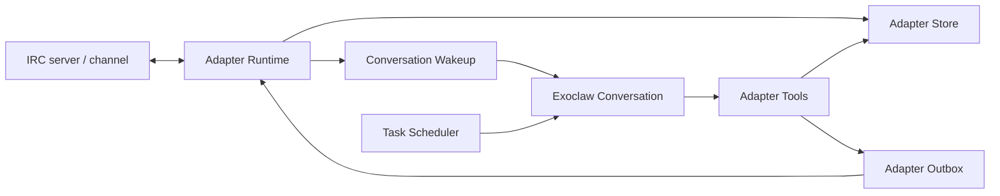
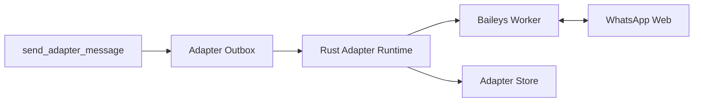

# Exoclaw Adapter Architecture

Exoclaw adapters are host-owned long-running integrations between an Exoclaw
conversation and an external application. The first adapter is IRC, but the
shape is intended to support Slack, Discord, WhatsApp, IRC networks, custom
local services, and agent-authored modules.

Adapters are deliberately not scheduled sandbox tasks. A scheduled task is a
periodic command: it starts, runs, writes output, wakes the conversation, and
exits. An adapter owns a live external connection: it keeps sockets open,
responds to protocol keepalives, reconnects after errors, parses inbound
messages, records event history, and wakes a conversation when something should
be handled by the agent.

## Components

The implementation is split across a few small executor and CLI modules:

- `crates/executor/src/adapter_types.rs` defines durable adapter records,
  source/kind enums, IRC/WhatsApp config, event records, and outbound message
  records.
- `crates/executor/src/adapter_store.rs` is the file-backed store under
  `.exo/adapters`. It stores adapter records, per-adapter event history, and
  the adapter outbox.
- `crates/executor/src/adapter_runtime.rs` supervises enabled adapters,
  dispatches by adapter kind, writes event artifacts, sends conversation
  wakeups, and queues outbound messages.
- `crates/executor/src/adapter_irc.rs` implements IRC connection behavior:
  TLS/plain TCP, `PASS`/`NICK`/`USER`, `JOIN`, `PING`/`PONG`, `PRIVMSG`
  parsing, trigger matching, and draining outbound messages over the persistent
  IRC connection.
- `crates/executor/src/adapter_worker.rs` implements the generic JSONL worker
  bridge used by host-supervised sidecar adapters such as WhatsApp.
- `examples/exoclaw/adapters/whatsapp/worker.ts` is the Baileys worker for the
  built-in WhatsApp adapter.
- `crates/executor/src/adapter_tools.rs` implements the host-backed tool calls
  used by Exoclaw.
- `typescript/harness/adapter-tools.ts` exposes the model-facing Exoclaw tools.
- `crates/cli/src/adapters.rs` provides `exo --harness exoclaw adapters ...`.
- `scripts/exoclaw-repl` starts the adapter runner next to the scheduler.

At a high level:



## Durable Records

Adapter state lives under `.exo/adapters`:

- `.exo/adapters/adapters/<adapter-id>.json` contains the `AdapterRecord`.
- `.exo/adapters/events/<adapter-id>/*.json` contains lifecycle, inbound,
  outbound, and error event records.
- `.exo/adapters/outbox/<adapter-id>/*.json` contains queued outbound messages
  waiting for the long-running adapter connection to send them.

The key record is `AdapterRecord`:

- `id`: stable adapter id used by tools and scheduler report prompts.
- `agent_id` and `conversation_id`: the owning Exoclaw agent/conversation.
- `name`: human-friendly adapter name.
- `source`: `built_in`, `library`, or `agent`.
- `kind`: `irc`, experimental `whatsapp`, or `module`.
- `enabled`: disabled adapters preserve history but stop receiving.
- `config`: adapter-specific config, such as IRC server/channel/nick.
- `latest_event_artifact_id`, `last_connected_at_ms`, `last_error`: runtime
  status fields.

## Tool Surface

Exoclaw exposes these adapter tools:

- `create_adapter`: create and enable an adapter.
- `list_adapters`: list adapters for the current conversation.
- `disable_adapter`: stop receiving while preserving history.
- `delete_adapter`: remove adapter state and event history.
- `send_adapter_message`: request an explicit outbound send.
- `install_agent_adapter`: persist agent-created adapter source.
- `build_agent_adapter`: validate and mark non-built-in adapters buildable.

All adapter tools are conversation-scoped. The TypeScript tool definitions add
the current `agentId` and `conversationId` before dispatching to Rust, and the
Rust tool handlers verify that the requested adapter belongs to that
conversation.

## IRC Adapter Example

An IRC adapter can be created from the REPL with arguments like:

```json
{
  "name": "libera-test",
  "source": "built_in",
  "config": {
    "type": "irc",
    "server": "irc.libera.chat",
    "port": 6697,
    "tls": true,
    "nick": "exo12345",
    "username": "exo12345",
    "realname": "Exoclaw Test Bot",
    "channel": "##exo12345",
    "passwordSecretId": null,
    "trigger": "mention"
  }
}
```

The runtime connects to the server, sends optional `PASS`, then `NICK` and
`USER`, waits for IRC welcome numeric `001`, joins the configured channel, and
keeps the socket open. It responds to `PING` with `PONG` so the server does not
disconnect it.

For each channel `PRIVMSG`, the runtime applies the trigger policy:

- `mention`: wake the conversation only if the message mentions the bot nick.
- `all_messages`: wake the conversation for every channel message.

The `mention` default is important. Busy channels can generate many messages,
and waking the model for every line would be noisy and expensive.

When a message matches, the runtime writes an inbound artifact containing the raw
line, parsed nick/channel/text, adapter id, and timestamps. It also records an
inbound event, then wakes the owning conversation with a user message that
includes the adapter id:

```text
IRC message received in ##exo12345 from spooky via adapter `libera-test`:

hello @exo12345

Use send_adapter_message with adapterId `...` if you should reply to IRC.
```

The agent decides whether to respond. There is no automatic model-output-to-IRC
bridge.

## WhatsApp Worker Example

The WhatsApp adapter uses the same durable adapter store and runtime lifecycle as
IRC, but delegates protocol-specific work to a Node.js worker:



The worker is launched with:

```bash
pnpm tsx examples/exoclaw/adapters/whatsapp/worker.ts
```

The runtime passes `EXO_ADAPTER_ID` and `EXO_WHATSAPP_AUTH_DIR`. If `authDir` is
not configured, auth state is stored under
`.exo/adapters/whatsapp/<adapter-id>/auth`. On first connection the worker emits
a `qr` event; scan that QR with WhatsApp to pair the account. After pairing, the
worker emits `connected` and then `message` events for text messages.

Worker communication is newline-delimited JSON:

- Worker to Rust: `qr`, `connected`, `message`, `error`, and `disconnected`.
- Rust to worker: `send_message` with `target` and `text`.

For inbound WhatsApp messages, the runtime writes an artifact with the chat id,
sender, message id, and text, then wakes the conversation. The wakeup instructs
the agent to call `send_adapter_message` with both the adapter id and WhatsApp
`target` chat id when a reply is appropriate.

The MVP is intentionally narrow: text messages only, one worker per WhatsApp
account/session, QR pairing through logs/artifacts, and no media handling or
message edits yet.

## Outbound Messages

Adapter sends must be explicit and auditable. When the agent calls
`send_adapter_message`, the tool does two things:

1. Writes an outbound artifact and event for history.
2. Writes an `AdapterOutboundMessageRecord` into the adapter outbox.

The long-running IRC adapter loop drains that outbox once per second and sends
queued messages as `PRIVMSG` over the already-connected IRC socket. The WhatsApp
runtime drains the same outbox and sends `send_message` commands to the Baileys
worker. WhatsApp messages require an outbox `target` chat id; IRC messages do
not because the destination channel is fixed in adapter config.

The outbox also decouples conversation turns from socket ownership. The model
turn can finish after queueing a message; the adapter runtime owns the external
connection and sends when it is ready.

## Adapter Runner Lifecycle

The adapter runner is started by:

```bash
./target/debug/exo --harness exoclaw adapters run --watch --limit 50
```

`scripts/exoclaw-repl` starts this automatically unless `--no-adapters` is
provided. It also records a pid file at `.exo/exoclaw-adapters.pid`.

In watch mode, the runtime periodically lists enabled adapters and starts one
supervision task per adapter. Each supervision task:

1. Loads the latest adapter record.
2. Skips disabled or not-yet-built adapters.
3. Connects and runs the adapter loop.
4. Records connection events and errors.
5. Reconnects after failures with a short delay.

Disabling or deleting the adapter causes the loop to stop on its next store
check or reconnect cycle.

## Cooperation With The Scheduler

The scheduler and adapter runtime cooperate through the conversation, not by
calling each other directly.

When a user says in IRC:

```text
exo12345: every minute, fetch BBC headlines and post them here
```

the flow is:

1. The IRC adapter receives the message and wakes the Exoclaw conversation.
2. The agent decides to create a scheduled task with `schedule_sandbox_task`.
3. The task stores normal scheduler state under `.exo/scheduled-tasks`.
4. The agent includes external routing in the task `reportPrompt`, including the
   `adapterId` and, for WhatsApp, the `target` chat id.
5. The scheduler runner executes the task when it is due.
6. The scheduler writes a task result artifact and wakes the conversation.
7. The scheduler wakeup includes the task `reportPrompt`, stdout/stderr preview,
   artifact id, and run metadata.
8. The agent follows the `reportPrompt` and calls `send_adapter_message`.
9. `send_adapter_message` queues an outbox record.
10. The adapter loop drains the outbox and posts the result to the external app.

The important bridge is the task `reportPrompt`. Scheduled tasks are generic;
they do not know that they were created from IRC unless the agent records that
intent. For IRC-originated scheduled work, the report prompt should say something
like:

```text
Summarize the headline output and send it back using send_adapter_message with
adapterId 019e... . For WhatsApp, include target 123@s.whatsapp.net. Keep the
message under 400 chars.
```

This keeps side effects explicit. The scheduler wakes the agent with the result,
and the agent performs the external send through the adapter tool.

## Background Credentials

Scheduler wakeups are model turns, so the scheduler process needs access to the
same model credentials as the REPL. On macOS, secrets may be encrypted with a
master key stored in Keychain. Background processes can fail with secure storage
errors until Keychain access is approved.

For local testing, running the scheduler once in a normal terminal and choosing
"Always Allow" in the macOS prompt lets future background runs decrypt the model
secret and post scheduled task results back to IRC.

## Source Model

Adapters mirror the tool source model:

- `built_in`: adapter implementations shipped with Exoclaw. IRC and experimental
  WhatsApp are currently built in.
- `library`: reusable adapter modules loaded from manifest metadata.
- `agent`: adapter modules written or installed by the agent at runtime.

The current runtime directly runs built-in IRC adapters and host-supervised
WhatsApp workers. Module-backed library and agent adapters are persisted and
build-validated so the registry boundary is in place; a future module runner can
implement the same host-owned lifecycle and outbox semantics without changing the
model-facing tools.

## Operational Notes

- Use short IRC nicks. Networks often reject long nicks during registration.
- Prefer `trigger: "mention"` for public or busy channels.
- `send_adapter_message` queues outbound messages; the adapter runner must be
  active for them to reach the external app.
- WhatsApp `send_adapter_message` calls must include the inbound chat id as
  `target`.
- If scheduled results do not appear in IRC, check scheduler run records first.
  The adapter may be healthy while the scheduler wakeup is failing.
- `disable_adapter` is the safe stop operation because it preserves history.
  `delete_adapter` removes the adapter and event/outbox state.
