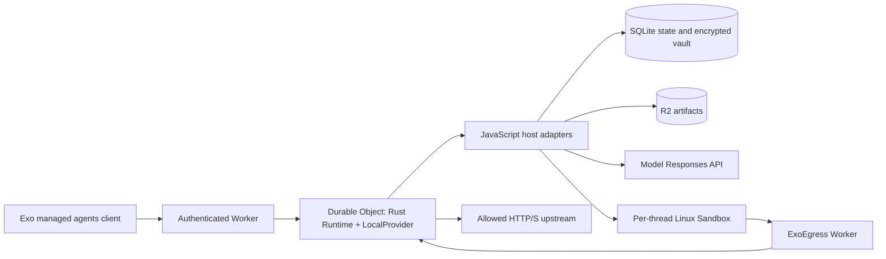

# Exo on Cloudflare: managed agents prototype

Exo's API, agent orchestration, state and credential proxy run in Workers and SQLite Durable Objects. The basic harness executes shell tools in a Linux sandbox; the Codex harness also runs its native app-server there. The shared Rust `Runtime` and `LocalProvider` run as WebAssembly inside the Worker. There is no Exo server image, proxy image or Dockerfile. Cloudflare's Linux Sandboxes are backed by Containers; the `containers` configuration attaches that execution capability to `ExoSandbox`.



## Implemented

- The existing Rust `BasicExoHarness` store: agents, threads, sessions, turns, events, artifacts and encrypted vaults. JavaScript supplies opaque byte storage in Durable Objects and R2.
- Managed-agent routes under `/exo` use the same Rust service functions as native Exo. The authenticated `/exo/request` endpoint dispatches the existing ExoHarness protocol in Rust.
- The existing Rust basic turn loop runs in Worker WebAssembly. JavaScript supplies storage, model Responses calls and shell execution through native Sandbox `exec`. The bridge polls Rust futures and holds host I/O with `waitUntil`; it requires no Tokio runtime or native threads.
- The existing Exo Codex harness, shared with the native deployment. Its app-server runs over native stdin/stdout/stderr with canonical shell/file/message events, persisted text deltas and saved thread resume.
- Per-thread sandbox execution using Cloudflare's managed `cloudflare/debian-trixie` image. No custom image build is needed.
- HTTP port 80 and HTTPS port 443 go through a Worker binding whose trusted props identify the agent/thread. Rust enforces the thread network policy and credential destinations. Other sandbox network access is disabled. Commands cannot select a different identity through request headers.
- Opaque environment placeholders, Bearer/custom header and Basic auth substitution, destination checks, manual redirects and live vault revocation. Vault values stay outside the sandbox.
- Filesystem snapshots and restoration after sandbox destruction. Sandboxes checkpoint on idle expiry or explicit stop; Codex's workspace and native history are included. Artifacts are stored separately in R2.

The deployment uses one shared Exo account, authenticated with either a preconfigured `EXO_TOKEN` using the existing client `--api-key-env` flow, or Cloudflare Access Managed OAuth. Every approved caller has access to that account's agents and vaults. Model credentials are resolved from attached vaults or the `global` vault and checked against their destination policy. Vault values use AES-GCM with the Worker secret `VAULT_KEY`; metadata is authenticated as associated data.

## Run and deploy

Install the repository dependencies, Wasm target and matching binding generator. All compilation artifacts stay in the repository `target` directory:

```sh
pnpm install
pnpm --dir exoharness/cloudflare install
rustup target add wasm32-unknown-unknown
cargo install wasm-bindgen-cli --version 0.2.115 --locked \
  --root exoharness/cloudflare/.local/tools --target-dir target/wasm-bindgen-cli
pnpm --dir exoharness/cloudflare run build:runtime
pnpm --dir exoharness/cloudflare typecheck
pnpm --dir exoharness/cloudflare test
```

`test` builds the real Worker bundle and runs Miniflare with real SQLite Durable Object and R2 storage. Its model and sandbox execution bindings are fixtures. Live tests below exercise the actual Cloudflare Linux sandbox.

The suite invokes the existing Rust core trait contracts against this backend through `HttpExoHarness` and `/exo/request`: CRUD, thread/conversation APIs, pagination, turn lifecycle and artifact ownership. Integration checks cover approvals, cancellation, SSE, persistence, credential substitution, Codex warm reuse and usage. Separate adapter tests execute the production sandbox lifecycle with a fixture for the platform container API. Run `test:live:contracts` against a deployed Worker to use the same Rust contracts there. Arbitrary process RPC is not implemented yet.

Choose the Worker name and R2 bucket in `wrangler.jsonc`, then authenticate Wrangler with your Cloudflare account. `ACCOUNT_ID` names the shared Exo account's Durable Object; it is separate from your Cloudflare account ID. Create the configured bucket and deploy:

```sh
pnpm --dir exoharness/cloudflare exec wrangler login
pnpm --dir exoharness/cloudflare exec wrangler r2 bucket create exo-managed-agents
pnpm --dir exoharness/cloudflare run deploy
```

Set `EXO_TOKEN` to a random bearer token and `VAULT_KEY` to a random 64-character hex key with `wrangler secret put` or `wrangler secret bulk`. Keep `VAULT_KEY` stable for this deployment's encrypted state. Do not commit credentials.

Use the deployment URL printed by Wrangler, with `/exo` appended, to create a provider profile:

```sh
exo provider create cloudflare \
  --url 'https://exo-managed-agents.<your-subdomain>.workers.dev/exo' \
  --api-key-env EXO_CLOUDFLARE_TOKEN
```

Set `EXO_CLOUDFLARE_TOKEN` locally to this Worker's `EXO_TOKEN` before using the profile. `exo provider login cloudflare` verifies the token and remembers the account. Pass `--provider cloudflare` on commands to select this provider.

Build the CLI if needed, then create and run an agent:

```sh
cargo build -p exo --no-default-features
export PATH="$PWD/target/debug:$PATH"
exo provider login cloudflare
exo --provider cloudflare agent create coder \
  --file exoharness/examples/managed-agents/coder.md
exo --provider cloudflare agent run --agent coder
```

Configure the model credential in an Exo vault before running the agent, as described below. The first run creates a saved thread. Resume with `exo --provider cloudflare agent run --agent coder --thread <slug>`. The sandbox's `/workspace` is remote; local files are not automatically mounted. Model traffic is permitted automatically; additional network origins require a sandbox policy.

## Authentication

With `ACCESS_AUD` unset, `EXO_TOKEN` is required and the client uses `--api-key-env`. With `ACCESS_AUD` set, the Worker requires Cloudflare's platform-verified `ctx.access` for that exact application audience. It accepts no static-token bypass in this mode. A caller-supplied `Cf-Access-Jwt-Assertion` or email header cannot authenticate a request. No authentication configuration means requests are rejected.

To use Cloudflare Access Managed OAuth:

1. Enable Zero Trust on the Cloudflare account and configure the desired identity provider.
2. Create a self-hosted Access application for `<your-worker-hostname>/exo/*`. Set an Allow policy for the intended users or groups.
3. In the application's Advanced settings, enable **Managed OAuth**, dynamic client registration, and **Allow loopback clients**. Exo uses an ephemeral `http://127.0.0.1:<port>/callback`. Set the access-token lifetime and grant-session duration as desired.
4. Copy the application's audience (AUD) tag to a Worker variable named `ACCESS_AUD`, using `wrangler.jsonc` or the dashboard. Deploy the Worker with this variable. `VAULT_KEY` and `ACCOUNT_ID` keep their existing values; `EXO_TOKEN` is unnecessary in Access mode.
5. Create a separate OAuth provider profile without `--api-key-env`:

   ```sh
   exo provider create cloudflare-oauth \
     --url 'https://exo-managed-agents.<your-subdomain>.workers.dev/exo'
   exo provider login cloudflare-oauth
   exo --provider cloudflare-oauth agent list
   ```

Access advertises its OAuth endpoints in the unauthenticated `401` challenge, handles browser login, and owns OAuth sessions. Exo uses its existing OAuth discovery, PKCE, credential store and refresh flow. The Worker checks Access's verified context before using a trusted Durable Object RPC entry point, because Access context does not propagate to that object. All approved Access users share `ACCOUNT_ID`; per-user ownership and permissions are outside this prototype.

For local Access simulation, add the following to `wrangler.jsonc`, alongside a matching `vars.ACCESS_AUD`:

```jsonc
"access": {
  "dev": {
    "aud": "exo-local",
    "identity": { "email": "operator@example.com" }
  }
}
```

This simulates the platform context in `wrangler dev`, without a browser login. The integration suite uses Miniflare's Access simulation to verify matching/wrong audiences, forged headers, rejection without authentication, request bodies, SSE, and the Durable Object boundary.

Cloudflare references: [Access for Workers and verified context](https://developers.cloudflare.com/workers/configuration/cloudflare-access/), [Managed OAuth settings and flow](https://developers.cloudflare.com/cloudflare-one/access-controls/applications/http-apps/managed-oauth/).

## Codex

Use the shared [`coder.md`](../examples/managed-agents/coder.md) example. It selects `harness: codex` and `gpt-6.1-sol`; the selected provider supplies the execution environment.

Create its `openai` model credential in an Exo vault:

```sh
exo --provider cloudflare vault secret create global openai \
  --token-env OPENAI_API_KEY --allow-origin https://api.openai.com
```

Attach a static model key in an Exo vault with an HTTPS destination policy for `https://api.openai.com` (or your Responses-compatible provider). Thread creation and turn submission use the same managed agents endpoints as the basic harness. Model traffic originates in the sandbox and passes through `ExoEgress`; the real key remains in the Worker vault. The shared sandbox policy builder adds the model credential binding with the same rules as native Exo.

The Worker streams the pinned Codex Linux package into the standard sandbox and verifies its SHA-512 integrity before extraction. It does not build a custom image or grant the agent access to the npm registry. `src/codex-package.json` must match `containers/codex-sandbox/version`. Node and Codex's bundled ripgrep are available; additional project dependencies need authorized network origins and installation.

The shared Codex harness reuses its app-server and native thread across turns while the sandbox is warm. The `CloudflareSandbox` adapter exposes the shared `SandboxProcess` interface and owns RPC capabilities, stream decoding and invocation lifetime. Its native exec invocation stays open until the process exits. Turns finish without stopping Codex or taking a filesystem snapshot. After five minutes of idle time, or an explicit sandbox stop, the sandbox closes its processes, checkpoints their files and stops. `/home/exo/.codex` preserves native thread history across sandbox destruction. A cold session uses `thread/resume`; Exo's existing recovery logic checks unresolved native tools before replaying an interrupted turn.

Codex currently supports `always_allow` permissions. `always_ask`, custom tools/MCP, and basic-harness token/round limits are rejected. Turns have a ten-minute execution limit. Cancellation stops the running sandbox. Snapshots preserve filesystem state; they do not make an interrupted tool safe to repeat.

## Live tests

The live scripts use static-token authentication. Set `EXO_WORKER_URL` to the Worker origin (without `/exo`) and `EXO_TOKEN` to its bearer token. Both agent tests require the `openai` credential in an Exo vault. The Codex test optionally accepts `EXO_CODEX_MODEL`. Supply variables through your shell or Node's `--env-file` option.

```sh
node exoharness/cloudflare/scripts/live-test.mjs
node exoharness/cloudflare/scripts/live-codex-test.mjs
node exoharness/cloudflare/scripts/live-contract-test.mjs
```

The agent tests create test agents and threads, exercise model/tool execution and sandbox restoration, and stop their sandboxes in `finally` blocks. They retain the remote agent history, snapshots and artifacts for inspection and print results to stdout. The contract runner executes the shared Rust ExoHarness core contracts against `/exo/request`.

## Limits

- The `basic` and `codex` harnesses, OpenAI-compatible Responses models and static key credentials are supported. Vault OAuth credential refresh, GitHub CLI credentials, Claude/Pi subprocess harnesses, MCP, custom tool modules, resources, custom execution images, adapters, frontend tools and delivery callbacks require additional integration. Unsupported definition/request options fail explicitly.
- The account Durable Object centralizes metadata and runs multiple thread turns. Per-user ownership and tenant isolation are not implemented.
- A persisted alarm invokes the shared runtime recovery scan after object eviction; model calls can repeat after a crash. Tool dispatch is journaled first. If a tool's outcome is ambiguous after interruption, the sandbox is stopped and the turn ends with an error; the command is never automatically replayed. This is not exactly-once execution.
- SSE sends canonical persisted events; Codex also persists `codex_text_delta` events. The basic harness collects model and shell output. Native process handles are used internally for Codex; arbitrary process and preview/port routing APIs are not exposed yet.
- Egress follows Exo's disabled, limited-host or unrestricted network policy. Credential bindings retain their own destination restrictions. Interception supports public HTTP/S destinations on ports 80/443; generic TCP/UDP proxying is outside this implementation.
- Sandboxes checkpoint and stop after five minutes of idle time or an explicit stop. Snapshots preserve files, not running processes; changes since the last checkpoint can be lost if the sandbox fails unexpectedly. Cloudflare currently expires unused snapshots after 30 days and ties them to their source image. Production should add R2 directory backups for longer retention/image migration.
- The built-in image has Node 24 and a minimal Linux userspace. Other agents need their dependencies installed or a suitable execution image. Node, Python, curl and Git trust variables point to Cloudflare's interception CA.
- Worker state uses Rust's record formats. Deploy into a fresh account namespace when replacing an older prototype that used the TypeScript store; there is no prototype-format migration.

Native Sandbox references: [run Linux commands](https://developers.cloudflare.com/sandbox/get-started/), [container API and interception](https://developers.cloudflare.com/containers/api/durable-object-container/), [authenticated API calls](https://developers.cloudflare.com/sandbox/network/call-an-authenticated-api/).
