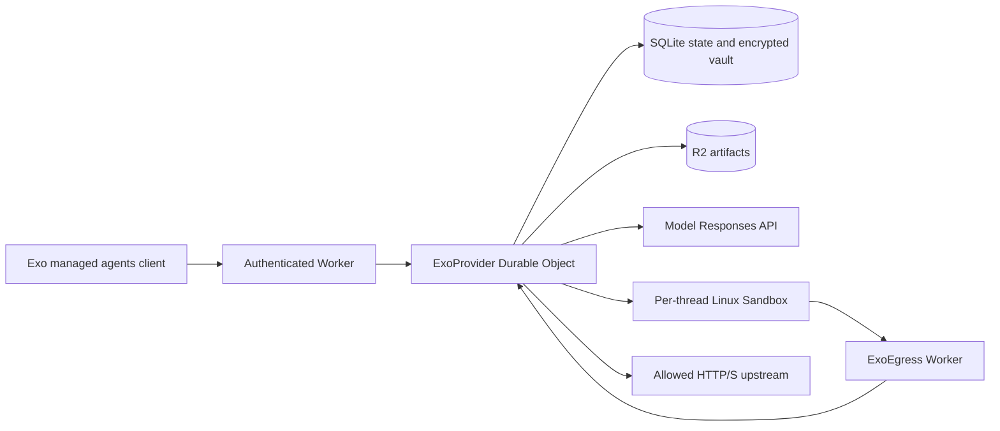

# Exo on Cloudflare: managed agents prototype

Exo's API, agent orchestration, state and credential proxy run in Workers and SQLite Durable Objects. The basic harness executes shell tools in a Linux sandbox; the Codex harness also runs its native app-server there. There is no Exo server image, proxy image, Dockerfile, or deployed Rust binary. Cloudflare's Linux Sandboxes are backed by Containers; the `containers` configuration attaches that execution capability to `ExoSandbox`.



## Implemented

- A TypeScript `ExoHarness` implementation: agents, conversations, sessions, turns, canonical event history, artifacts and encrypted static-key vaults.
- The existing managed agents HTTP protocol under `/exo`: agent definitions as artifacts, threads, turns, status, cancellation, approvals, event queries and resumable SSE.
- The existing portable Responses runtime and Lingua conversion, including a precompiled WASM module. The agent loop runs in the Worker; `shell` runs through native sandbox `exec`.
- The existing Exo Codex harness, shared with the native deployment. Its app-server runs over native stdin/stdout/stderr with canonical shell/file/message events, persisted text deltas and saved thread resume.
- Per-thread sandbox execution using Cloudflare's managed `cloudflare/debian-trixie` image. No custom image build is needed for the test.
- Default-deny egress. HTTP port 80 and HTTPS port 443 go through a Worker binding whose trusted props identify the agent/thread. Commands cannot select a different identity through request headers.
- Opaque environment placeholders, Bearer/custom header and Basic auth substitution, destination checks, manual redirects and live vault revocation. Vault values stay outside the sandbox.
- Explicit filesystem snapshots and restoration after sandbox destruction. Codex automatically snapshots its workspace and native history after each successful turn. Artifacts are stored separately in R2.

The deployment is a single operator/account prototype, authenticated with `EXO_TOKEN`. Model credentials are resolved from attached vaults or the `global` vault and checked against their destination policy. Vault values use AES-GCM with the Worker secret `VAULT_KEY`; metadata is authenticated as associated data.

## Run and deploy

Install the repository dependencies and this package's dependencies:

```sh
pnpm install
pnpm --dir exoharness/cloudflare install
pnpm --dir exoharness/cloudflare typecheck
pnpm --dir exoharness/cloudflare test
```

`test` builds the real Worker bundle and runs Miniflare with real SQLite Durable Object and R2 storage. Its model and sandbox execution bindings are fixtures. Live tests below exercise the actual Cloudflare Linux sandbox.

`wrangler.jsonc` targets the separate `exo-managed-agents-spike` Worker and R2 bucket in Braintrust Enterprise. Change the account, Worker, bucket and `ACCOUNT_ID` for another deployment. After `wrangler login`, create the R2 bucket and deploy:

```sh
pnpm --dir exoharness/cloudflare exec wrangler r2 bucket create exo-managed-agents-spike
pnpm --dir exoharness/cloudflare run deploy
```

Set `EXO_TOKEN` to a random bearer token and `VAULT_KEY` to a random 64-character hex key with `wrangler secret put` or `wrangler secret bulk`. Keep `VAULT_KEY` stable for this deployment's encrypted state. Do not commit credentials. The optional `PROBE_KEY` enables a synthetic test receiver at `/_probe` that returns authentication booleans without reflecting the key.

The tested endpoint is `https://exo-managed-agents-spike.braintrust.workers.dev/exo`. The existing CLI can configure it with:

```sh
exo provider configure cloudflare-spike \
  --url https://exo-managed-agents-spike.braintrust.workers.dev/exo \
  --api-key-env EXO_CLOUDFLARE_TOKEN
```

Set `EXO_CLOUDFLARE_TOKEN` locally to this Worker's `EXO_TOKEN` before using the profile. This prototype has been tested through its HTTP protocol; the local Rust CLI binary was not built for this investigation.

## Codex

Save an agent definition with `harness: codex`:

```markdown
---
name: Cloudflare Coder
harness: codex
config:
  model: gpt-5.4
  credential: global/OPENAI_API_KEY
---

Work in /workspace. Implement the requested changes and run tests.
```

Attach a static model key in an Exo vault with an HTTPS destination policy for `https://api.openai.com` (or your Responses-compatible provider). Thread creation and turn submission use the same managed agents endpoints as the basic harness. Model traffic originates in the sandbox and passes through `ExoEgress`; the real key remains in the Worker vault. The model origin and `OPENAI_API_KEY` placeholder binding are installed automatically alongside the thread's egress policy.

The Worker streams the pinned Codex Linux package into the standard sandbox and verifies its SHA-512 integrity before extraction. It does not build a custom image or grant the agent access to the npm registry. `src/codex-package.json` must match `containers/codex-sandbox/version` (currently 0.153.4). Node and Codex's bundled ripgrep are available; additional project dependencies need authorized network origins and installation.

A fresh app-server starts for each turn. Its native exec invocation stays open while RPC capabilities transport its pipes and control methods. After completion, the app-server closes, its files flush, and the Worker saves a filesystem snapshot. `/home/exo/.codex` preserves native thread history across sandbox destruction. The next turn uses `thread/resume`; Exo's existing recovery logic checks unresolved native tools before replaying an interrupted turn.

Codex currently supports `always_allow` permissions. `always_ask`, custom tools/MCP, and basic-harness token/round limits are rejected. Turns have a ten-minute execution limit. Cancellation destroys the running sandbox; only the last successful snapshot is restored afterward.

## Live verification

The live test reads `OPENAI_API_KEY` from the repository `.env` and uploads it into the Worker's encrypted `global` vault. It reads the private `.local/secrets.json` used to provision `EXO_TOKEN`, `VAULT_KEY` and the synthetic `PROBE_KEY`. It creates a test agent/thread, runs the assertions, and stops its sandbox in a `finally` block. It leaves the agent history, snapshot and artifacts for inspection.

```sh
node exoharness/cloudflare/scripts/live-test.mjs
node exoharness/cloudflare/scripts/live-codex-test.mjs
```

On October 4, 2026, live checks passed for Linux execution, opaque placeholders, HTTPS and Basic credential injection, denied destinations, unknown placeholders, bare-IP TLS with certificate validation disabled, direct UDP TXT DNS, snapshot restoration with interception reinstalled, R2 artifacts, a real model → shell → model turn, and revocation on a running sandbox. The ignored `.local/live-results.json` records test IDs and the passing assertions.

The Codex live test uses the already provisioned `global/OPENAI_API_KEY` vault credential. On October 4, 2026, it passed a real `gpt-5.4` coding turn that created two files and ran three tests, then destroyed the sandbox and resumed the same native Codex thread. The follow-up recalled a tag from the earlier conversation, edited the restored test file, and ran four passing tests. Placeholder-only credentials, denied unrelated HTTPS and persisted text deltas also passed. `.local/codex-results.json` records the test IDs and results; the script stops its sandbox in `finally`.

A TCP connection on port 443 can connect to the interceptor before TLS routing is checked. A successful socket connection alone is not evidence of external access. Intercepted A/AAAA DNS queries receive platform-generated addresses; the DNS bypass test uses a TXT query to an explicit public resolver.

## Limits and remaining work

This establishes that the platform supplies the essential gadgets; it is not a drop-in deployment of `exo serve`.

- The `basic` and `codex` harnesses, OpenAI-compatible Responses models and static key credentials are supported. OAuth refresh, GitHub CLI credentials, Claude/Pi subprocess harnesses, MCP, custom tool modules, resources, environment definitions, adapters, frontend tools and delivery callbacks require additional integration. Unsupported definition/request options fail explicitly.
- The account Durable Object centralizes metadata and runs multiple thread jobs. Production needs tenant authorization and a deliberate partitioning scheme, quotas, audit logging and encrypted-key rotation.
- A persisted alarm recovers unfinished jobs; model calls can repeat after a crash. Tool dispatch is journaled first. If a tool's outcome is ambiguous after interruption, the sandbox is stopped and the turn ends with an error; the command is never automatically replayed. This is not exactly-once execution.
- SSE sends canonical persisted events; Codex also persists `codex_text_delta` events. The basic harness collects model and shell output. Native process handles are used internally for Codex; arbitrary process and preview/port routing APIs are not exposed yet.
- Egress rules allow exact public HTTP/S origins on ports 80/443. Extra ports need native intercept registrations. Generic TCP/UDP proxying is outside this implementation.
- Sandboxes stop after five minutes of inactivity. The basic harness requires an explicit snapshot before stop; Codex checkpoints after successful turns. Snapshots preserve files, not running processes; Cloudflare currently expires unused snapshots after 30 days and ties them to their source image. Production should add checkpoint policy and R2 directory backups for longer retention/image migration.
- The built-in image has Node 24 and a minimal Linux userspace. Other agents need their dependencies installed or a suitable execution image. Node, Python, curl and Git trust variables point to Cloudflare's interception CA; only Node's HTTPS behavior was exercised live here.
- Agent/thread deletion, artifact operations and forks need further concurrency/cleanup work before treating this as production storage. API coverage is intentionally partial; unimplemented routes return 404.

Native Sandbox references: [run Linux commands](https://developers.cloudflare.com/sandbox/get-started/), [container API and interception](https://developers.cloudflare.com/containers/api/durable-object-container/), [authenticated API calls](https://developers.cloudflare.com/sandbox/network/call-an-authenticated-api/).
